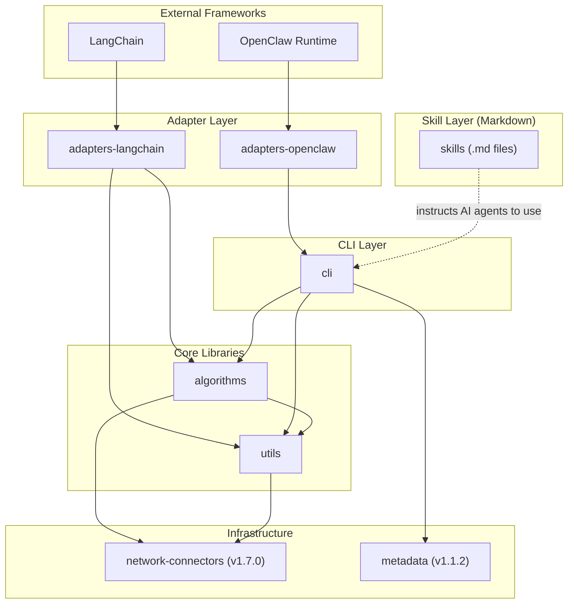
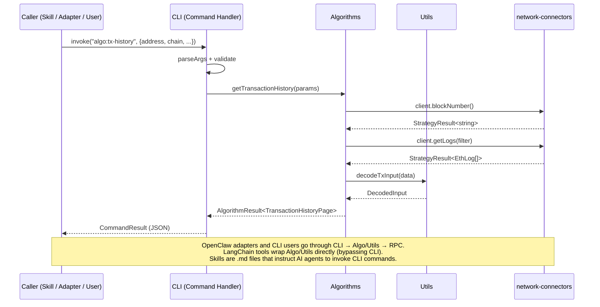

# OpenScan Modular AI System — Architecture & Implementation Specification

## 1. Executive Summary

This specification defines a modular, TypeScript-first AI system built on top of OpenScan's existing `@openscan/network-connectors` and `@openscan/metadata` packages. The system introduces 5 new npm packages (`@openscan/algorithms`, `@openscan/utils`, `@openscan/cli`, `@openscan/adapters-langchain`, `@openscan/adapters-openclaw`) plus a markdown-based skills package (`@openscan/skills`) organized in a turborepo monorepo.

The core execution model is **Skill → CLI → Algorithms/Utils/Connectors**. Business logic lives exclusively in `algorithms` and `utils`; the CLI wraps them as commands; skills are markdown-based procedural knowledge files (following the skills.sh/agentskills.io format) that instruct AI agents how to use the CLI; and framework adapters (LangChain wrapping algorithms/utils directly, OpenClaw via CLI) provide programmatic integration.

All data is on-chain only (no centralized indexing APIs). Historical queries explicitly require archival RPC nodes or fall back to bounded windows.

---

## 2. Assumptions and Non-Goals

### Assumptions
- `@openscan/network-connectors` API is stable (v1.7.0). We depend on `NetworkClient`, `ClientFactory`, `StrategyResult<T>`, `StrategyConfig`.
- `@openscan/metadata` is consumed as a JSON data source (no TypeScript API dependency).
- Archival RPC nodes are available for historical queries; when unavailable, algorithms degrade gracefully with bounded-window fallbacks.
- ClawHub and Skills.sh have standard registration APIs (labeled as assumed — adapter contracts defined, concrete API calls TBD).
- OpenClaw runtime has a plugin/registration model (assumed — we define the integration contract).

### Non-Goals
- Frontend/React components (the explorer app is separate).
- Centralized indexing, caching infrastructure, or database layer.
- Wallet management or transaction signing (utils provides EIP-712 encoding, not key management).
- Real-time streaming subscriptions (v2 consideration).
- Solana and Aztec algorithm support in MVP (EVM + Bitcoin first).

---

## 3. High-Level Architecture Diagram



---

## 4. Execution Flow Diagram



---

## 5. Repo Strategy

**Decision: Turborepo monorepo** (new repo: `ai`)

Rationale:
- Shared TypeScript config, Biome config, and test infrastructure.
- Atomic cross-package changes (e.g., adding a new algorithm + CLI command + skill in one PR).
- `@openscan/algorithms` and `@openscan/utils` remain **independently publishable** via per-package `package.json` with independent semver.

### Independent Versioning
- Each package has its own `package.json` with its own version.
- Use `changesets` for independent versioning and release management.
- CI publishes only packages whose version changed.
- `@openscan/network-connectors` and `@openscan/metadata` remain in their existing repos as external npm dependencies.

### Package Manager
- **pnpm** with workspaces (consistent with hardhat-plugin, good monorepo support).

---

## 6. Folder Structure

```
ai/
├── packages/
│   ├── utils/                     # @openscan/utils
│   │   ├── src/
│   │   │   ├── abi/               # ABI encode/decode
│   │   │   ├── tx/                # Transaction input decoding
│   │   │   ├── events/            # Event log decoding
│   │   │   ├── address/           # Validation, type detection (EOA/contract)
│   │   │   ├── hex/               # Hex/data formatting
│   │   │   ├── units/             # Unit conversions (wei, gwei, ether)
│   │   │   ├── signatures/        # Signature parsing/formatting
│   │   │   ├── chain/             # Chain-specific normalization
│   │   │   ├── eip712/            # Sign typed data (EIP-712)
│   │   │   └── index.ts
│   │   ├── tests/
│   │   ├── package.json
│   │   └── tsconfig.json
│   │
│   ├── algorithms/                # @openscan/algorithms
│   │   ├── src/
│   │   │   ├── tx-history/        # Transaction history per address
│   │   │   ├── token-balance/     # Token balance history
│   │   │   ├── gas-price/         # Gas price history per network
│   │   │   ├── shared/            # Pagination, caching, types
│   │   │   └── index.ts
│   │   ├── tests/
│   │   ├── package.json
│   │   └── tsconfig.json
│   │
│   ├── cli/                       # @openscan/cli
│   │   ├── src/
│   │   │   ├── commands/          # Command implementations
│   │   │   │   ├── algo/          # Algorithm commands
│   │   │   │   └── util/          # Utility commands
│   │   │   ├── registry.ts        # Extensible command registry
│   │   │   ├── handlers/          # Reusable command handlers (importable)
│   │   │   ├── output/            # JSON, table, streaming formatters
│   │   │   ├── bin.ts             # CLI entry point
│   │   │   └── index.ts           # Programmatic entry (exports handlers)
│   │   ├── package.json
│   │   └── tsconfig.json
│   │
│   ├── skills/                    # @openscan/skills (markdown-based, skills.sh format)
│   │   ├── blockchain-analysis/   # Blockchain analysis skill
│   │   │   ├── SKILL.md           # Main skill instructions for AI agents
│   │   │   ├── metadata.json      # Skill metadata (version, author, refs)
│   │   │   ├── rules/             # Individual rule files
│   │   │   │   ├── tx-history.md
│   │   │   │   ├── token-balance.md
│   │   │   │   ├── gas-analysis.md
│   │   │   │   ├── address-profiling.md
│   │   │   │   └── ...
│   │   │   ├── scripts/           # Optional helper scripts
│   │   │   └── AGENTS.md          # Auto-generated compiled rules
│   │   └── README.md
│   │
│   ├── adapters-langchain/        # @openscan/adapters-langchain
│   └── adapters-openclaw/         # @openscan/adapters-openclaw
│
├── tooling/
│   ├── tsconfig/                  # Shared TypeScript configs
│   └── biome/                     # Shared Biome config
│
├── turbo.json
├── pnpm-workspace.yaml
├── package.json
├── biome.json
└── CLAUDE.md
```

---

## 7. Core TypeScript Interfaces

### 7.1 Result & Error Typing

```typescript
// packages/utils/src/types.ts

/** Universal result envelope for all operations */
export interface OpResult<T> {
  success: boolean;
  data?: T;
  error?: OpError;
  metadata?: OpMetadata;
}

export interface OpError {
  code: string;           // e.g., "ARCHIVAL_RPC_REQUIRED", "INVALID_ADDRESS"
  message: string;
  details?: unknown;
}

export interface OpMetadata {
  chainId: number | string;
  duration: number;       // ms
  rpcCalls: number;
  archivalRequired: boolean;
  timestamp: number;
}
```

### 7.2 Algorithm Contracts

```typescript
// packages/algorithms/src/shared/types.ts

export interface AlgorithmParams {
  chainId: number | string;
  rpcUrls: string[];
  strategyType?: "fallback" | "parallel" | "race";
}

export interface PaginationParams {
  fromBlock?: number | string;
  toBlock?: number | string;
  pageSize?: number;
  cursor?: string;
}

export interface AlgorithmResult<T> extends OpResult<T> {
  pagination?: {
    hasMore: boolean;
    nextCursor?: string;
    totalBlocks?: number;
  };
}

/** Transaction History */
export interface TxHistoryParams extends AlgorithmParams {
  address: string;
  pagination?: PaginationParams;
}

export interface TxHistoryEntry {
  hash: string;
  blockNumber: number;
  timestamp: number;
  from: string;
  to: string | null;
  value: string;
  gasUsed: string;
  gasPrice: string;
  status: "success" | "failure";
  methodId?: string;
  decodedMethod?: string;
}

export interface TxHistoryPage {
  entries: TxHistoryEntry[];
  address: string;
  chainId: number | string;
}

/** Token Balance History */
export interface TokenBalanceParams extends AlgorithmParams {
  address: string;
  tokenAddress: string;
  pagination?: PaginationParams;
}

export interface TokenBalanceEntry {
  blockNumber: number;
  timestamp: number;
  balance: string;
  change: string;
  txHash: string;
}

export interface TokenBalancePage {
  entries: TokenBalanceEntry[];
  address: string;
  tokenAddress: string;
  chainId: number | string;
}

/** Gas Price History */
export interface GasPriceParams extends AlgorithmParams {
  pagination?: PaginationParams;
  granularity?: "block" | "hour" | "day";
}

export interface GasPriceEntry {
  blockNumber: number;
  timestamp: number;
  baseFee: string;
  avgGasPrice: string;
  minGasPrice: string;
  maxGasPrice: string;
  gasUsedRatio: number;
}

export interface GasPricePage {
  entries: GasPriceEntry[];
  chainId: number | string;
}

/** Algorithm interface contract */
export interface Algorithm<TParams, TResult> {
  readonly name: string;
  readonly description: string;
  readonly supportedChains: (number | string)[];
  execute(params: TParams): Promise<AlgorithmResult<TResult>>;
}
```

### 7.3 Utility Module Contracts

```typescript
// packages/utils/src/index.ts (public API surface)

export interface AddressInfo {
  address: string;
  isValid: boolean;
  type: "eoa" | "contract" | "unknown";
  checksummed: string;
  chainType: "evm" | "bitcoin" | "solana";
}

export interface DecodedInput {
  methodId: string;
  methodName?: string;
  params: DecodedParam[];
}

export interface DecodedParam {
  name: string;
  type: string;
  value: unknown;
}

export interface DecodedEvent {
  name: string;
  signature: string;
  params: DecodedParam[];
}

// ABI module
export function encodeABI(abi: AbiFunction, args: unknown[]): string;
export function decodeABI(abi: AbiFunction, data: string): DecodedParam[];

// Transaction module
export function decodeTxInput(data: string, abi?: AbiFunction[]): DecodedInput;

// Event module
export function decodeEventLog(log: { topics: string[]; data: string }, abi?: AbiEvent[]): DecodedEvent;

// Address module
export function validateAddress(address: string, chainType?: string): AddressInfo;
export function detectAddressType(address: string, client: NetworkClient): Promise<AddressInfo>;

// Hex module
export function hexToNumber(hex: string): bigint;
export function numberToHex(n: bigint | number): string;
export function hexToUtf8(hex: string): string;
export function padHex(hex: string, length: number): string;

// Units module
export function weiToEther(wei: string | bigint): string;
export function etherToWei(ether: string): bigint;
export function weiToGwei(wei: string | bigint): string;
export function gweiToWei(gwei: string): bigint;
export function formatUnits(value: string | bigint, decimals: number): string;
export function parseUnits(value: string, decimals: number): bigint;

// Signatures module
export function parseSignature(sig: string): { r: string; s: string; v: number };
export function formatSignature(r: string, s: string, v: number): string;

// EIP-712 module
export function encodeTypedData(domain: EIP712Domain, types: EIP712Types, value: Record<string, unknown>): string;
export function hashTypedData(domain: EIP712Domain, types: EIP712Types, value: Record<string, unknown>): string;
```

### 7.4 CLI Command Contracts

```typescript
// packages/cli/src/types.ts

export interface CommandDefinition {
  name: string;                    // e.g., "algo:tx-history"
  description: string;
  args: ArgDefinition[];
  flags: FlagDefinition[];
  handler: CommandHandler;
}

export interface ArgDefinition {
  name: string;
  description: string;
  required: boolean;
  type: "string" | "number" | "boolean";
}

export interface FlagDefinition {
  name: string;
  alias?: string;
  description: string;
  type: "string" | "number" | "boolean";
  default?: unknown;
}

export type OutputFormat = "json" | "table" | "stream";

export interface CommandContext {
  outputFormat: OutputFormat;
  chainId: number | string;
  rpcUrls: string[];
  strategyType: "fallback" | "parallel" | "race";
  verbose: boolean;
}

export interface CommandResult<T = unknown> {
  exitCode: number;           // 0 = success, 1 = error, 2 = partial
  data?: T;
  error?: OpError;
  metadata?: OpMetadata;
}

export type CommandHandler = (
  args: Record<string, unknown>,
  ctx: CommandContext,
) => Promise<CommandResult>;

/** Command registry for extensibility */
export interface CommandRegistry {
  register(command: CommandDefinition): void;
  get(name: string): CommandDefinition | undefined;
  list(): CommandDefinition[];
  execute(name: string, args: Record<string, unknown>, ctx: CommandContext): Promise<CommandResult>;
}
```

### 7.5 Skill Format (skills.sh / agentskills.io)

Skills are **markdown-based procedural knowledge files** that instruct AI agents how to use the `openscan` CLI. They follow the skills.sh format:

**SKILL.md** (frontmatter + instructions):
```markdown
---
name: openscan-blockchain-analysis
description: Procedural knowledge for on-chain blockchain analysis using the openscan CLI
license: MIT
metadata:
  author: openscan
  version: "1.0.0"
---

# OpenScan Blockchain Analysis

Comprehensive on-chain analysis skill for AI agents using the `openscan` CLI tool.

## When to Apply

- When a user asks about transaction history for an address
- When analyzing gas prices or fee trends on a network
- When tracking token balance changes over time
- When profiling a blockchain address (type detection, balance, activity)

## Prerequisites

The `openscan` CLI must be installed: `npm install -g @openscan/cli`

## Available Commands

| Command | Description | Impact |
|---------|-------------|--------|
| `openscan algo:tx-history` | Transaction history for an address | HIGH |
| `openscan algo:gas-price` | Gas price history for a network | MEDIUM |
| `openscan algo:token-balance` | Token balance history | HIGH |
| `openscan util:address-type` | Detect address type (EOA/contract) | LOW |
| `openscan util:decode-input` | Decode transaction input data | MEDIUM |
| `openscan util:balance` | Get native token balance | LOW |

## Rules

See individual rule files in `rules/` for detailed usage patterns per command.
```

**metadata.json**:
```json
{
  "version": "1.0.0",
  "organization": "OpenScan",
  "date": "March 2026",
  "abstract": "On-chain blockchain analysis skill for AI agents. Provides procedural knowledge for transaction history, gas analysis, token tracking, and address profiling using the openscan CLI.",
  "references": [
    "https://github.com/openscan-explorer"
  ]
}
```

**rules/tx-history.md** (individual rule):
```markdown
---
title: Transaction History Retrieval
impact: HIGH
tags: transactions, history, address, on-chain
---

## Transaction History Retrieval

Use `openscan algo:tx-history` to retrieve on-chain transaction history for an address.

**Basic usage:**
```bash
openscan algo:tx-history 0xd8dA6BF26964aF9D7eEd9e03E53415D37aA96045 \
  --chain 1 --rpc https://eth.llamarpc.com --output json
```

**With pagination:**
```bash
openscan algo:tx-history 0x... --chain 1 --rpc https://... \
  --from-block 19000000 --to-block 19100000 --page-size 50
```

**Important notes:**
- Requires archival RPC for historical blocks (>128 blocks back)
- Default window: last 10,000 blocks
- Use `--output table` for human-readable output, `--output json` for piping
```

### 7.6 Tool Adapter Contracts

```typescript
// packages/adapters-langchain/src/types.ts

/**
 * LangChain tools wrap algorithms/utils DIRECTLY (not through CLI).
 * They use LangChain's tool() function with Zod schemas.
 * No shared adapter interface needed — LangChain defines the contract.
 */

import type { StructuredToolInterface } from "@langchain/core/tools";
import type { Algorithm, AlgorithmResult } from "@openscan/algorithms";

/** Factory to create a LangChain tool from any Algorithm */
export function createToolFromAlgorithm<TParams, TResult>(
  algo: Algorithm<TParams, TResult>,
  schema: ZodSchema,
  mapInputs: (toolInput: Record<string, unknown>) => TParams,
): StructuredToolInterface;


// packages/adapters-openclaw/src/types.ts

/** OpenClaw adapter dispatches to CLI command handlers */
export interface OpenClawToolAdapter {
  readonly name: string;
  readonly description: string;
  getSchema(): unknown;
  execute(params: Record<string, unknown>): Promise<CommandResult>;
}
```

---

## 8. Package Specifications

### 8.1 `@openscan/utils`
- **Dependencies**: None (zero production deps, matching network-connectors philosophy)
- **Peer deps**: `@openscan/network-connectors` (optional, for `detectAddressType`)
- **Build**: TypeScript → ESM, tsc
- **Test**: Node.js native test runner (matching network-connectors)
- **Key extraction targets from explorer**: `addressTypeDetection.ts`, `eventDecoder.ts`, `inputDecoder.ts`, `hexUtils.ts`, `unitFormatters.ts`, `bitcoinFormatters.ts`

### 8.2 `@openscan/algorithms`
- **Dependencies**: `@openscan/utils`, `@openscan/network-connectors`
- **Build**: TypeScript → ESM, tsc
- **Test**: Node.js native test runner with real RPC calls
- **Algorithms**: `TransactionHistoryAlgorithm`, `TokenBalanceHistoryAlgorithm`, `GasPriceHistoryAlgorithm`

### 8.3 `@openscan/cli`
- **Dependencies**: `@openscan/algorithms`, `@openscan/utils`, `@openscan/network-connectors`, `@openscan/metadata`
- **CLI framework**: `citty` (lightweight, TypeScript-first, no decorators)
- **Binary**: `openscan` (via package.json `bin` field)
- **Dual entry**: `bin.ts` (CLI) + `index.ts` (programmatic import of handlers)

### 8.4 `@openscan/skills`
- **Format**: Markdown-based (skills.sh / agentskills.io format)
- **No TypeScript dependencies** — skills are `.md` files with frontmatter
- **Prerequisite**: `@openscan/cli` must be installed (skills instruct agents to invoke CLI commands)
- **Installation**: `npx skills add openscan/blockchain-analysis`
- **Skills**: `blockchain-analysis` (covers tx history, gas analysis, token tracking, address profiling as rules)

### 8.5 Adapter Packages

**`@openscan/adapters-langchain`**:
- **Dependencies**: `@openscan/algorithms`, `@openscan/utils`, `@openscan/network-connectors`
- **Peer deps**: `@langchain/core`, `zod`
- **Design**: LangChain `tool()` wrappers that call algorithms/utils directly (not through CLI)
- **Exports**: Pre-built tools (`getTransactionHistory`, `getGasPriceHistory`, `getAddressType`, etc.) + factory helpers to create custom tools from algorithms

**`@openscan/adapters-openclaw`**:
- **Dependencies**: `@openscan/cli` (imports handlers)
- **Peer deps**: `@openclaw/sdk` (assumed)

---

## 9. Example Implementations

### 9.1 Transaction History Algorithm

```typescript
// packages/algorithms/src/tx-history/TransactionHistoryAlgorithm.ts
import { ClientFactory, type StrategyConfig, type EthLog } from "@openscan/network-connectors";
import { hexToNumber, decodeTxInput } from "@openscan/utils";
import type {
  Algorithm, AlgorithmResult, TxHistoryParams, TxHistoryPage, TxHistoryEntry
} from "../shared/types.js";

export class TransactionHistoryAlgorithm
  implements Algorithm<TxHistoryParams, TxHistoryPage> {

  readonly name = "tx-history";
  readonly description = "Retrieve transaction history for an address via on-chain log scanning";
  readonly supportedChains = [1, 10, 56, 137, 8453, 42161, 43114, 31337, 11155111];

  async execute(params: TxHistoryParams): Promise<AlgorithmResult<TxHistoryPage>> {
    const startTime = Date.now();
    const config: StrategyConfig = {
      type: params.strategyType ?? "fallback",
      rpcUrls: params.rpcUrls,
    };
    const client = ClientFactory.createClient(params.chainId as number, config);

    try {
      // Determine block range
      const latestResult = await client.execute<string>("eth_blockNumber", []);
      if (!latestResult.success || !latestResult.data) {
        return { success: false, error: { code: "RPC_ERROR", message: "Failed to get block number" } };
      }
      const latestBlock = Number(hexToNumber(latestResult.data));
      const fromBlock = params.pagination?.fromBlock
        ? Number(params.pagination.fromBlock)
        : Math.max(0, latestBlock - 10000); // Default: last 10k blocks
      const toBlock = params.pagination?.toBlock
        ? Number(params.pagination.toBlock)
        : latestBlock;
      const pageSize = params.pagination?.pageSize ?? 100;

      // Scan outgoing txs by iterating blocks (simplified — production would use getLogs for Transfer events)
      const entries: TxHistoryEntry[] = [];
      // ... pagination and block scanning logic ...

      return {
        success: true,
        data: {
          entries,
          address: params.address,
          chainId: params.chainId,
        },
        pagination: {
          hasMore: entries.length >= pageSize,
          nextCursor: entries.length >= pageSize ? String(fromBlock) : undefined,
        },
        metadata: {
          chainId: params.chainId,
          duration: Date.now() - startTime,
          rpcCalls: 2, // blockNumber + getLogs
          archivalRequired: fromBlock < latestBlock - 128,
          timestamp: Date.now(),
        },
      };
    } finally {
      await client.close();
    }
  }
}
```

### 9.2 Gas Price History Algorithm

```typescript
// packages/algorithms/src/gas-price/GasPriceHistoryAlgorithm.ts
import { ClientFactory } from "@openscan/network-connectors";
import { hexToNumber, weiToGwei } from "@openscan/utils";
import type { Algorithm, AlgorithmResult, GasPriceParams, GasPricePage } from "../shared/types.js";

export class GasPriceHistoryAlgorithm
  implements Algorithm<GasPriceParams, GasPricePage> {

  readonly name = "gas-price-history";
  readonly description = "Retrieve gas price history using eth_feeHistory";
  readonly supportedChains = [1, 10, 56, 137, 8453, 42161, 43114, 31337, 11155111];

  async execute(params: GasPriceParams): Promise<AlgorithmResult<GasPricePage>> {
    const config = { type: params.strategyType ?? "fallback", rpcUrls: params.rpcUrls };
    const client = ClientFactory.createClient(params.chainId as number, config);

    try {
      const blockCount = params.pagination?.pageSize ?? 100;
      const newestBlock = params.pagination?.toBlock ?? "latest";

      // eth_feeHistory returns baseFee and gasUsedRatio for a range of blocks
      const feeResult = await client.execute<{
        baseFeePerGas: string[];
        gasUsedRatio: number[];
        oldestBlock: string;
      }>("eth_feeHistory", [
        `0x${blockCount.toString(16)}`,
        typeof newestBlock === "number" ? `0x${newestBlock.toString(16)}` : newestBlock,
        [25, 50, 75], // percentiles
      ]);

      if (!feeResult.success || !feeResult.data) {
        return { success: false, error: { code: "RPC_ERROR", message: "eth_feeHistory failed" } };
      }

      const { baseFeePerGas, gasUsedRatio, oldestBlock } = feeResult.data;
      const startBlock = Number(hexToNumber(oldestBlock));
      const entries = baseFeePerGas.slice(0, -1).map((baseFee, i) => ({
        blockNumber: startBlock + i,
        timestamp: 0, // Would need getBlockByNumber for timestamps
        baseFee,
        avgGasPrice: weiToGwei(baseFee),
        minGasPrice: weiToGwei(baseFee),
        maxGasPrice: weiToGwei(baseFee),
        gasUsedRatio: gasUsedRatio[i] ?? 0,
      }));

      return {
        success: true,
        data: { entries, chainId: params.chainId },
        pagination: {
          hasMore: startBlock > 0,
          nextCursor: String(startBlock - 1),
        },
      };
    } finally {
      await client.close();
    }
  }
}
```

### 9.3 Token Balance History Algorithm

```typescript
// packages/algorithms/src/token-balance/TokenBalanceHistoryAlgorithm.ts
import { ClientFactory, type EthLog } from "@openscan/network-connectors";
import { hexToNumber, formatUnits } from "@openscan/utils";
import type { Algorithm, AlgorithmResult, TokenBalanceParams, TokenBalancePage } from "../shared/types.js";

// ERC-20 Transfer event signature
const TRANSFER_TOPIC = "0xddf252ad1be2c89b69c2b068fc378daa952ba7f163c4a11628f55a4df523b3ef";

export class TokenBalanceHistoryAlgorithm
  implements Algorithm<TokenBalanceParams, TokenBalancePage> {

  readonly name = "token-balance-history";
  readonly description = "Track ERC-20 token balance changes via Transfer event logs";
  readonly supportedChains = [1, 10, 56, 137, 8453, 42161, 43114, 31337, 11155111];

  async execute(params: TokenBalanceParams): Promise<AlgorithmResult<TokenBalancePage>> {
    const config = { type: params.strategyType ?? "fallback", rpcUrls: params.rpcUrls };
    const client = ClientFactory.createClient(params.chainId as number, config);

    try {
      const paddedAddress = `0x${params.address.slice(2).toLowerCase().padStart(64, "0")}`;

      // Get Transfer events TO or FROM address
      const logsResult = await client.execute<EthLog[]>("eth_getLogs", [{
        address: params.tokenAddress,
        topics: [TRANSFER_TOPIC, null], // Filter Transfer events
        fromBlock: params.pagination?.fromBlock ?? "earliest",
        toBlock: params.pagination?.toBlock ?? "latest",
      }]);

      if (!logsResult.success || !logsResult.data) {
        return { success: false, error: { code: "RPC_ERROR", message: "getLogs failed" } };
      }

      // Filter logs where address is sender or receiver
      const relevantLogs = logsResult.data.filter(
        (log) => log.topics[1] === paddedAddress || log.topics[2] === paddedAddress,
      );

      let runningBalance = 0n;
      const entries = relevantLogs.map((log) => {
        const value = BigInt(log.data);
        const isIncoming = log.topics[2] === paddedAddress;
        const change = isIncoming ? value : -value;
        runningBalance += change;

        return {
          blockNumber: Number(hexToNumber(log.blockNumber)),
          timestamp: 0,
          balance: runningBalance.toString(),
          change: change.toString(),
          txHash: log.transactionHash,
        };
      });

      return {
        success: true,
        data: { entries, address: params.address, tokenAddress: params.tokenAddress, chainId: params.chainId },
      };
    } finally {
      await client.close();
    }
  }
}
```

### 9.4 CLI Command Implementation

```typescript
// packages/cli/src/commands/algo/txHistory.ts
import { TransactionHistoryAlgorithm } from "@openscan/algorithms";
import type { CommandDefinition, CommandHandler } from "../../types.js";

const handler: CommandHandler = async (args, ctx) => {
  const algo = new TransactionHistoryAlgorithm();
  const result = await algo.execute({
    address: args.address as string,
    chainId: ctx.chainId,
    rpcUrls: ctx.rpcUrls,
    strategyType: ctx.strategyType,
    pagination: {
      fromBlock: args.fromBlock as string | undefined,
      toBlock: args.toBlock as string | undefined,
      pageSize: args.pageSize as number | undefined,
    },
  });

  return {
    exitCode: result.success ? 0 : 1,
    data: result.data,
    error: result.error,
    metadata: result.metadata,
  };
};

export const txHistoryCommand: CommandDefinition = {
  name: "algo:tx-history",
  description: "Get transaction history for an address",
  args: [
    { name: "address", description: "Target address", required: true, type: "string" },
  ],
  flags: [
    { name: "from-block", description: "Start block", type: "string" },
    { name: "to-block", description: "End block", type: "string" },
    { name: "page-size", description: "Results per page", type: "number", default: 100 },
  ],
  handler,
};

// Re-export handler for programmatic use
export { handler as txHistoryHandler };
```

### 9.5 Skill Rule Example (Markdown)

```markdown
<!-- packages/skills/blockchain-analysis/rules/address-profiling.md -->
---
title: Address Profiling Workflow
impact: HIGH
tags: address, profile, workflow, multi-step
---

## Address Profiling Workflow

To build a comprehensive profile of a blockchain address, run these commands in sequence:

**Step 1 — Detect address type:**
` ``bash
openscan util:address-type 0x<ADDRESS> --chain <CHAIN_ID> --rpc <RPC_URL> --output json
` ``
This returns whether the address is an EOA, contract, or proxy.

**Step 2 — Get native balance:**
` ``bash
openscan util:balance 0x<ADDRESS> --chain <CHAIN_ID> --rpc <RPC_URL> --output json
` ``

**Step 3 — Get recent transaction history:**
` ``bash
openscan algo:tx-history 0x<ADDRESS> --chain <CHAIN_ID> --rpc <RPC_URL> \
  --page-size 50 --output json
` ``

**Step 4 — (If contract) Decode recent transactions:**
` ``bash
openscan algo:tx-history 0x<ADDRESS> --chain <CHAIN_ID> --rpc <RPC_URL> \
  --output json | openscan util:decode-input --abi <ABI_PATH>
` ``

**Combining results:** Aggregate the JSON outputs from steps 1-3 to present a
unified address profile with type, balance, and activity summary.
```

---

## 10. Framework Integration Examples

### 10.1 LangChain

LangChain tools wrap `@openscan/algorithms` and `@openscan/utils` directly using LangChain's `tool()` function with Zod schemas. They do NOT go through the CLI layer.

```typescript
// packages/adapters-langchain/src/tools/txHistory.ts
import { tool } from "@langchain/core/tools";
import { z } from "zod";
import { TransactionHistoryAlgorithm } from "@openscan/algorithms";
import { validateAddress } from "@openscan/utils";

export const getTransactionHistory = tool(
  async ({ address, chainId, rpcUrls, pageSize }) => {
    const addrInfo = validateAddress(address);
    if (!addrInfo.isValid) {
      return `Invalid address: ${address}`;
    }

    const algo = new TransactionHistoryAlgorithm();
    const result = await algo.execute({
      address,
      chainId,
      rpcUrls,
      pagination: { pageSize },
    });

    if (!result.success) {
      return `Error: ${result.error?.message ?? "Unknown error"}`;
    }
    return JSON.stringify(result.data, null, 2);
  },
  {
    name: "get_transaction_history",
    description: "Get on-chain transaction history for a blockchain address by scanning logs",
    schema: z.object({
      address: z.string().describe("The blockchain address to look up"),
      chainId: z.number().describe("EVM chain ID (1=Ethereum, 137=Polygon, etc.)"),
      rpcUrls: z.array(z.string()).describe("RPC endpoint URLs for the chain"),
      pageSize: z.number().optional().default(50).describe("Max results per page"),
    }),
  }
);

// packages/adapters-langchain/src/tools/gasPrice.ts
import { GasPriceHistoryAlgorithm } from "@openscan/algorithms";

export const getGasPriceHistory = tool(
  async ({ chainId, rpcUrls, blockCount }) => {
    const algo = new GasPriceHistoryAlgorithm();
    const result = await algo.execute({
      chainId,
      rpcUrls,
      pagination: { pageSize: blockCount },
    });

    if (!result.success) {
      return `Error: ${result.error?.message ?? "Unknown error"}`;
    }
    return JSON.stringify(result.data, null, 2);
  },
  {
    name: "get_gas_price_history",
    description: "Get gas price history for a network using eth_feeHistory",
    schema: z.object({
      chainId: z.number().describe("EVM chain ID"),
      rpcUrls: z.array(z.string()).describe("RPC endpoint URLs"),
      blockCount: z.number().optional().default(100).describe("Number of blocks to query"),
    }),
  }
);

// packages/adapters-langchain/src/tools/addressType.ts
import { validateAddress, detectAddressType } from "@openscan/utils";
import { ClientFactory } from "@openscan/network-connectors";

export const getAddressType = tool(
  async ({ address, chainId, rpcUrls }) => {
    const info = validateAddress(address);
    if (!info.isValid) return `Invalid address: ${address}`;

    const client = ClientFactory.createClient(chainId, {
      type: "fallback",
      rpcUrls,
    });
    try {
      const fullInfo = await detectAddressType(address, client);
      return JSON.stringify(fullInfo, null, 2);
    } finally {
      await client.close();
    }
  },
  {
    name: "detect_address_type",
    description: "Detect whether an address is an EOA, contract, or proxy",
    schema: z.object({
      address: z.string().describe("Blockchain address to check"),
      chainId: z.number().describe("EVM chain ID"),
      rpcUrls: z.array(z.string()).describe("RPC endpoint URLs"),
    }),
  }
);

// Usage: register tools with a LangChain agent
import { createToolCallingAgent, AgentExecutor } from "langchain/agents";
import { ChatAnthropic } from "@langchain/anthropic";

const tools = [getTransactionHistory, getGasPriceHistory, getAddressType];
const llm = new ChatAnthropic({ modelName: "claude-sonnet-4-6" });
const agent = createToolCallingAgent({ llm, tools, prompt });
const executor = new AgentExecutor({ agent, tools });
```

### 10.2 CLI Invocation

```bash
# Transaction history
openscan algo:tx-history 0xd8dA6BF26964aF9D7eEd9e03E53415D37aA96045 \
  --chain 1 --rpc https://eth.llamarpc.com --output json

# Gas price history
openscan algo:gas-price --chain 1 --page-size 50 --output table

# Utility: address type detection
openscan util:address-type 0xd8dA6BF26964aF9D7eEd9e03E53415D37aA96045 --chain 1

# Utility: decode tx input
openscan util:decode-input 0x... --abi ./MyContract.json

# Pipe JSON output
openscan algo:tx-history 0x... --output json | jq '.entries[0]'
```

---

## 11. OpenClaw Runtime Design

```typescript
// packages/adapters-openclaw/src/index.ts

/** OpenClaw registration manifest (assumed schema) */
export interface OpenClawManifest {
  name: string;
  version: string;
  description: string;
  capabilities: CapabilityDescriptor[];
  skills: SkillRegistration[];
  tools: ToolRegistration[];
}

export interface CapabilityDescriptor {
  name: string;
  description: string;
  chains: (number | string)[];
}

export interface SkillRegistration {
  name: string;
  description: string;
  /** Path to SKILL.md for agent consumption */
  skillPath: string;
}

export interface ToolRegistration {
  name: string;
  schema: unknown;
  execute: (params: Record<string, unknown>) => Promise<CommandResult>;
}

/** Build OpenClaw manifest from registered commands */
export function buildOpenClawManifest(
  commands: CommandDefinition[],
): OpenClawManifest {
  return {
    name: "@openscan/blockchain-toolkit",
    version: "1.0.0",
    description: "On-chain blockchain analysis tools, algorithms, and skills",
    capabilities: [
      { name: "transaction-analysis", description: "Transaction history and analysis", chains: [1, 10, 56, 137] },
      { name: "gas-analysis", description: "Gas price history and trends", chains: [1, 10, 56, 137] },
      { name: "token-tracking", description: "Token balance history", chains: [1, 10, 56, 137] },
    ],
    skills: [{ name: "blockchain-analysis", description: "On-chain analysis skill", skillPath: "./skills/blockchain-analysis/SKILL.md" }],
    tools: commands.map(c => ({
      name: c.name,
      schema: { /* auto-generated from command args/flags */ },
      execute: (params) => c.handler(params, {} as any),
    })),
  };
}
```

---

## 12. Publishing Flow

### Step 1: Skill Creation
Write SKILL.md with frontmatter + rules in `packages/skills/blockchain-analysis/`.
Each rule is a separate `.md` file in `rules/` describing how to use a specific CLI command.

### Step 2: Compile AGENTS.md
Build the compiled AGENTS.md from individual rules (optional build step for aggregated output).

### Step 3: Package Build (CLI + core libs)
```bash
pnpm --filter @openscan/cli build
pnpm --filter @openscan/algorithms build
pnpm --filter @openscan/utils build
```

### Step 4: npm Publish
```bash
pnpm changeset     # Bump versions
pnpm changeset publish
```

### Step 5: Skills.sh Registration
Skills are published as a GitHub repository. Users install via:
```bash
npx skills add openscan/blockchain-analysis
```
This copies the SKILL.md and rules/ into the user's project, making the procedural knowledge available to their AI agent (Claude Code, Cursor, etc.). The skill appears on the skills.sh leaderboard automatically once users start installing it.

### Step 6: ClawHub Registration
```bash
# ClawHub manifest (assumed format)
openscan publish:clawhub blockchain-analysis \
  --registry https://clawhub.ai \
  --capabilities "transaction-analysis,address-profiling,balance-tracking" \
  --version 1.0.0
```

### Step 7: OpenClaw Registration
Build manifest via `buildOpenClawManifest()` and register with OpenClaw runtime.

---

## 13. Risks, Trade-offs, and Mitigations

| Risk | Impact | Mitigation |
|------|--------|------------|
| **Archival RPC required** for historical queries | Users without archival nodes get empty/limited results | Explicit `archivalRequired` flag in metadata; bounded-window fallback; clear error messages |
| **On-chain-only constraint** makes tx history slow | Block scanning is O(n) vs indexed O(1) | Efficient pagination; `eth_getLogs` with narrow filters; optional local caching layer (v2) |
| **Rate limiting** from public RPC providers | Algorithm execution may fail under load | Strategy pattern (fallback across providers); configurable retry/backoff; user-supplied RPC URLs |
| **Cross-chain type inconsistencies** | Bitcoin/EVM have fundamentally different models | Chain-specific algorithm implementations behind shared interface; utils handle normalization |
| **ClawHub/Skills.sh API instability** | Publishing flow may break | Adapter contracts isolate publishing logic; registry implementations are swappable |
| **Monorepo complexity** | More tooling to maintain | Turborepo handles caching; pnpm workspaces are well-supported; independent versioning via changesets |

---

## 14. Phased Implementation Plan

### Phase 1: MVP (Weeks 1–4)

**Goal**: Core libraries + CLI working end-to-end

1. **Week 1**: Repo scaffolding
   - Turborepo + pnpm workspace setup
   - Shared tsconfig, biome config
   - CI pipeline (lint, typecheck, test, build)

2. **Week 2**: `@openscan/utils`
   - Extract and adapt from explorer utils: hex, units, address validation, ABI encode/decode
   - Event log decoding, tx input decoding
   - EIP-712 typed data encoding
   - Full test coverage with Node.js native test runner

3. **Week 3**: `@openscan/algorithms`
   - `GasPriceHistoryAlgorithm` (simplest — uses `eth_feeHistory`)
   - `TransactionHistoryAlgorithm` (eth_getLogs based)
   - `TokenBalanceHistoryAlgorithm` (Transfer event scanning)
   - Integration tests against real RPCs

4. **Week 4**: `@openscan/cli`
   - Command registry, output formatters (JSON, table)
   - Commands for all 3 algorithms + key utils
   - Programmatic handler exports
   - Binary `openscan` with `--chain`, `--rpc`, `--output` flags

### Phase 2: Skills (Week 5)

5. **Week 5**: `@openscan/skills`
   - Write SKILL.md with frontmatter for `blockchain-analysis`
   - Individual rule files: tx-history, gas-analysis, token-balance, address-profiling
   - metadata.json and build script for AGENTS.md compilation
   - README with installation instructions (`npx skills add openscan/blockchain-analysis`)

### Phase 3: Framework Adapters (Week 6)

6. **Week 6**: `adapters-langchain` + `adapters-openclaw`
   - LangChain DynamicStructuredTool wrappers
   - OpenClaw manifest builder and registration
   - Tool schema generation from CommandDefinition
   - Integration tests

### Phase 4: Publishing & Polish (Week 7)

7. **Week 7**: Publishing flow
   - Skills.sh packaging and registration
   - ClawHub registration
   - Documentation, README per package
   - npm publish pipeline

### v2 (Post-MVP)
- Streaming/incremental responses for long-running algorithms
- Local caching layer (SQLite or LevelDB) for algorithm results
- Multi-skill coordination (parallel skill execution)
- Solana + Aztec algorithm support
- Bitcoin-specific algorithms (UTXO analysis, mempool tracking)
- Benchmarking suite for algorithm performance
- WebSocket subscription-based real-time algorithms

---

## 15. Testing Strategy

| Layer | Framework | Approach |
|-------|-----------|----------|
| `utils` | Node.js native test runner | Unit tests, deterministic, no RPC |
| `algorithms` | Node.js native test runner | Integration tests against real RPCs (matching network-connectors pattern) |
| `cli` | Node.js native test runner | Command handler unit tests + CLI integration tests |
| `skills` | Markdown lint + manual | Validate frontmatter, verify CLI commands referenced exist |
| `adapters-*` | Node.js native test runner | Schema generation tests + mock execution |

### Verification
```bash
# Full test suite
pnpm test

# Individual package
pnpm --filter @openscan/utils test
pnpm --filter @openscan/algorithms test

# CLI end-to-end
openscan algo:tx-history 0xd8dA6BF26964aF9D7eEd9e03E53415D37aA96045 --chain 1 --output json

# Type check all packages
pnpm typecheck
```

---

## Files to Create/Modify

### New Repository
- `ai/` — entire new monorepo

### Key Files
- `packages/utils/src/index.ts` — public API
- `packages/algorithms/src/index.ts` — algorithm exports
- `packages/algorithms/src/shared/types.ts` — shared types
- `packages/cli/src/bin.ts` — CLI entry
- `packages/cli/src/registry.ts` — command registry
- `packages/cli/src/handlers/index.ts` — programmatic handler exports
- `packages/skills/blockchain-analysis/SKILL.md` — main skill instructions
- `packages/skills/blockchain-analysis/metadata.json` — skill metadata
- `packages/skills/blockchain-analysis/rules/*.md` — individual rule files
- `packages/adapters-langchain/src/index.ts` — LangChain adapter
- `packages/adapters-openclaw/src/index.ts` — OpenClaw adapter

### Copy from Explorer (explorer will later import from @openscan/utils)
- `explorer/src/utils/addressTypeDetection.ts` → `packages/utils/src/address/`
- `explorer/src/utils/eventDecoder.ts` → `packages/utils/src/events/`
- `explorer/src/utils/inputDecoder.ts` → `packages/utils/src/tx/`
- `explorer/src/utils/hexUtils.ts` → `packages/utils/src/hex/`
- `explorer/src/utils/unitFormatters.ts` → `packages/utils/src/units/`
- `explorer/src/utils/bitcoinFormatters.ts` → `packages/utils/src/chain/bitcoin.ts`
